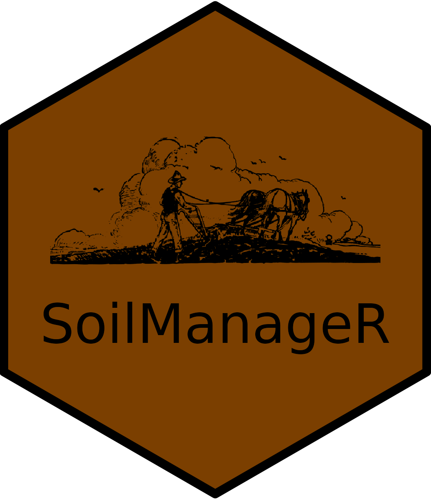
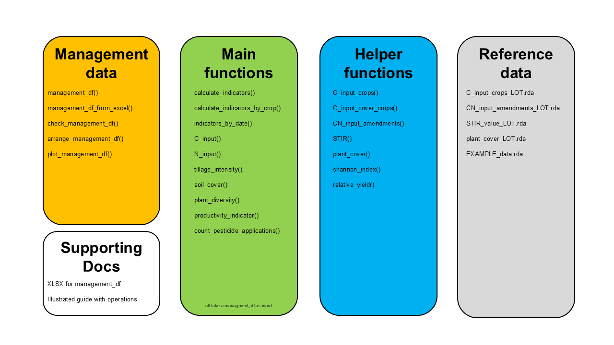
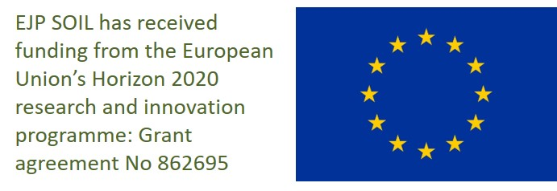

{width="150"}

# SoilManageR

## Introduction

This R package is a compilation of functions to calculate numerical agricultural soil management indicators from a management timeline of an arable field. The functions can also be used independently of the management timeline to calculate some indicators or parts thereof. Throughout the package, many assumptions were made (e.g. on time to crop establishment). These assumptions are, whenever possible, based on the literature that is cited within the function descriptions. The assumptions are considered to be representative for temperate agro-ecosystems, i.e. in the Swiss midlands.

A scientific publication describing the package and its functions was published in the *European Journal of Soil Science* [(Heller et al., 2025)](http://doi.org/10.1111/ejss.70102). Please cite this publication when using the package in your work.

{width="700"}

SoilManageR organizes management data in management data frames `management_df()`, from this the indicators can then be calculated. For the calculations there are main functions and helper functions that are called by the main functions (Fig. 1). Both type of functions rely on reference data for their calculations. The package is distributed with some supporting documents. Further documents, e.g. the illustrated guide to identify soil management operations, can be found on [Zenodo](https://zenodo.org/communities/soilmanager/).

## Installation

You can install the current release version of SoilManageR from [CRAN](https://cran.r-project.org/) with:

``` r
# install released version
install.packages("SoilManageR")
```

or you can install the development version of SoilManageR from [GitLab](https://about.gitlab.com/) with:

``` r
# install development version
install.packages("devtools")
devtools::install_gitlab("SoilManageR/SoilManageR")
```

## Suggested Workflow

### Load and check management data frame

We suggest to start the workflow with importing a `management_df()` from a XLSX template.

```         
library(SoilManageR)

# define path to excel template in the SoilManageR package
internal_path <- "/extdata/SoilManageR_mgmt_data_template_V2.6.xlsx"

# create local path
path_to_xlsx_template <- system.file(internal_path, package = "SoilManageR")

# load management_df
mgmt_data <- management_df_from_excel(path_to_xlsx_template)
```

Then the `management_df()` can be checked for internal consistency with the `check_management_df()` function.

```         
# create management_df from example data (delivered with the package)
mgmt_data <- EXAMPLE_data

# arrange the example data by date and order of operations
mgmt_data <- arrange_management_df(mgmt_data)

# check the consistency of the example data
check_management_df(mgmt_data)
```
The `management_df()` can be visualized too.
```
# visualise the example data
plot_management_df(mgmt_data)
```
{width="500"}


### Calculate indicators per year or by crop

When the `management_df()` shows no relevant issues, then all indicators can be calculated with `calculate_indicators()` per year or with `calculate_indicators_by_crop()` by crop. Furthermore, indicators can be calculated by a specific date, e.g. by a sampling date.

```         
# calculate indicators by year
calculate_indicators(mgmt_data)

# calculate indicators by crop
calculate_indicators_by_crop(mgmt_data)

# calculate indicators by date
indicators_by_date(mgmt_data, "2020-08-01")
```

Alternatively, the indicators could be calculated individually

```         
# estimate carbon input
C_input(mgmt_data)

# calculate tillage intensity
tillage_intensity(mgmt_data)

# calculate soil cover
soil_cover(mgmt_data)

# calculate nitrogen input and livestock intensity
N_input(mgmt_data)

# calculate plant diversity indication
plant_diversity(mgmt_data,2013,2023)

# count number of pesticide applications
count_pesticide_applications(mgmt_data)
```

Users can also customize the calculation of the indicators by using the extended output of the indicator calculation functions.

```         
# extended output for the estimate carbon input
C_input(mgmt_data, extended.output = TRUE)

# extended output for the calculate tillage intensity
tillage_intensity(mgmt_data, extended.output = TRUE)

# extended output for the calculate soil cover
soil_cover(mgmt_data, extended.output = TRUE)

# visualize the extended output for the soil cover
soil_cover_data <- soil_cover(mgmt_data, extended.output = TRUE)
plot(soil_cover_data)

# extended output for the calculate nitrogen input and livestock intensity
N_input(mgmt_data, extended.output = TRUE)
```

### Access helper functions

All helper functions can be called directly, please check Fig.1 and the description of the functions for more information on them.

## About the Package

### Acknowledgments

This R package was developed by following the book [R Packages (2nd Edition)](https://r-pkgs.org/) by [Hadley Wickham](https://hadley.nz/) and [Jennifer Bryan](https://jennybryan.org/). Our work is based on the accomplishments of many others. In particular, we would like to thank Sonja Keel (Agroscope, Switzerland), Martin Bolinder (SLU, Sweden), Giulio Feruzzi (USDA-NRCS, USA), Lucie Büchi (University of Greenwich, United Kingdom) for their advice and support.

### Contact

For further information on SoilManageR please contact [olivier.heller\@agroscope.admin.ch](mailto:olivier.heller@agroscope.admin.ch) or [raphael.wittwer\@agroscope.admin.ch](mailto:raphael.wittwer@agroscope.admin.ch).

### Funding information

The development of this R package was supported by EJP SOIL.


[{width="300"}](https://ejpsoil.eu/)

{width="200"}
